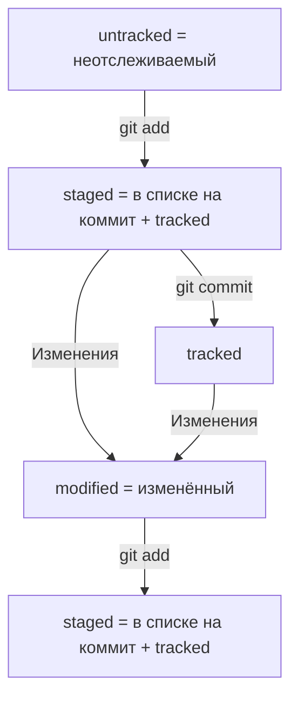

# Консоль

- cd - перемещение  
- mkdir, rmdir - создать, удалить директорию(папку)  
- mkdir -p - создать структуру директорий(папок)  
- touch, rm - создать, удалить файл  
- cp - копировать файл  
- mv - переместить файл  
- rm w-r - удаляется директория(папка) с файлами  
- cat - просмотреть содержимое файла  
- ls - просмотреть содержимое директории(папки)  
- ls -a - расширенный список  
- && - разделение между командами если пишешь их в строку  
- cd ~ - домашняя директория(папка)  
- cd / - корневая директория(папка)  
- clip < - копировать содержимое файла в буфер обмена  
- echo >>/> - Дополнить файл/перезаписать файл

---

# Git  

- git init - инициализировать репозиторий  
- git status - проверить статус/состояние репозитория  
- Чтобы разгитить директорию нужно удалить скрытую папку .git  
- git add --all - запомнить изменения  
- git commit -m - сохранить изменения + присвоить сообщение  
- git log - посмотреть историю коммитов  

---

# GitHub  

- $ ssh-keygen -t ed25519 -C "электронная почта, к которой привязан ваш аккаунт на GitHub" - генерация ключа SSH который далее добавляется в GitHib  
- git remote add ~~название удаленного репозитория, обычно называют origin~~ __вставить url репозитория в GitHub__ - связывание репозиториев  
- git remote -v - убедиться что репозитории связаны  
- git push -u origin master ~~main~~ - отправить изменения на удалённый репозиторий писать так только в 1 раз дальше можно просто git push  

---

# Разметка md  

Текст над чертой
---
Текст под чертой
#### Загловок 4
Текст до переноса  
После переноса  

Новый параграф

Курсив это *звёздочки* или _нижние подчеркивания_

Полужирный шрифт — двойные **звёздочки** или двойные __подчёркивания__.
Можно совместить выделение **звёздочки и _подчёркивания_**.

~~Зачёркнутый текст окружён двойными тильдами~~

1. Нумерованный список
2. Просто цифры с точками
* Не нумерованный
* Звёздочкой с пробелом
- Либо дефис с пробелом

[Яндекс](https://www.yandex.ru)

[Яндекс](https://www.yandex.ru "Я Yandex!")

``` python
print("Hello world!")
```  

---  

# Хеши  

- Git преобразует информацию о коммитах с помощью алгоритма SHA-1 и для каждого из них рассчитывает уникальный идентификатор — хеш.  
- Хеш — основной идентификатор коммита и позволяет узнать его автора, дату и содержимое закоммиченных файлов.  
- Все хеши, а также таблицу соответствий хеш → информация о коммите Git хранит в папке .git.  

- Можно вызвать не только полный лог, но и сокращённый — это делается командой git log --oneline.  
В сокращённом логе выводятся сокращённые хеши — их можно использовать точно так же, как и полные.  

- В числе прочих файлов в папке .git есть служебный файл HEAD. Он указывает на самый свежий коммит.  
Вместо хеша последнего коммита можно написать слово HEAD — Git вас поймёт. 

--- 



---  

# КАК ВЫЙТИ ИЗ VIM  

1. Нажмите клавишу Esc.
2. Наберите последовательность символов :qa!.
3. Нажмите Enter.

---  

# Изменение последнего коммита  

- --amend рассчитан на работу с последним коммитом (HEAD).  
- Дополнить коммит новыми файлами можно с помощью git commit --amend --no-edit. Благодаря опции --no-edit сообщение к коммиту останется таким, каким и было.  
- Изменить сообщение к коммиту позволяет команда git commit --amend -m "Обновлённое сообщение коммита".  

---

# Откаты в коммитах  

- Команда git restore --staged <file> переведёт файл из staged обратно в modified или untracked.  
- Команда git reset --hard <commit hash> «откатит» историю до коммита с хешем <hash>. Более поздние коммиты потеряются!  
- Команда git restore <file> «откатит» изменения в файле до последней сохранённой (в коммите или в staging) версии.  

---  

# Просмотр изменений  

- Команда git diff сравнит последнюю закоммиченную версию файла с той, что находится в состоянии modified.  
- Команда git diff --staged покажет изменения в staged-файлах относительно последних закоммиченных версий.  

- git diff показывает изменения, которые не были добавлены в staged.  
- git log --oneline показывает первые несколько символов хеша и сообщение коммита.  
- git diff --staged показывает, что изменилось в проиндексированных файлах.  
- git diff a9928ab 11bada1 покажет различия коммитов с хешами a9928ab и 11bada1.  

---  

# Игнорирование файлов  

- Если нужно, чтобы Git игнорировал какие-то файлы, стоит составить файл .gitignore.  
- Посмотреть, что игнорируется, можно с помощью команды git status --ignored.  
- Сам файл .gitignore — это обычный файл в репозитории. Его тоже стоит закоммитить.  
- Шаблонов много, но их легко найти в интернете вместе с примерами использования.  

---  

