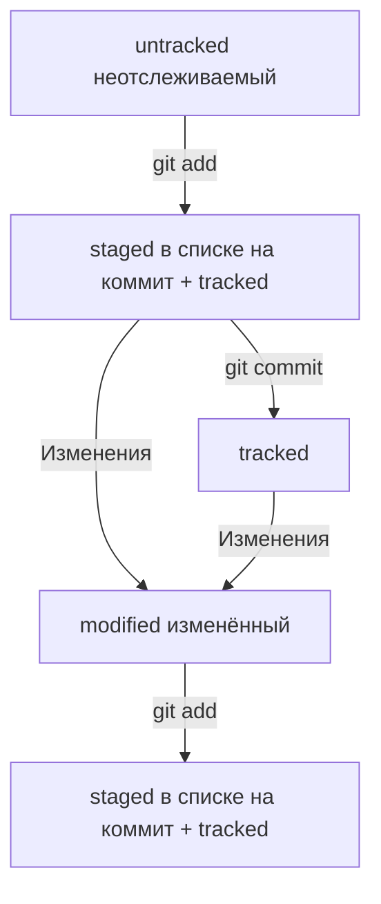

# Консоль

cd - перемещение  
mkdir, rmdir - создать, удалить директорию(папку)  
mkdir -p - создать структуру директорий(папок)  
touch, rm - создать, удалить файл  
cp - копировать файл  
mv - переместить файл  
rm w-r - удаляется директория(папка) с файлами  
cat - просмотреть содержимое файла  
ls - просмотреть содержимое директории(папки)  
ls -a - расширенный список  
&& - разделение между командами если пишешь их в строку  
cd ~ - домашняя директория(папка)  
cd / - корневая директория(папка)  
clip < - копировать содержимое файла в буфер обмена  

---

# Git  

git init - инициализировать репозиторий  
git status - проверить статус/состояние репозитория  
Чтобы разгитить директорию нужно удалить скрытую папку .git  
git add --all - запомнить изменения  
git commit -m - сохранить изменения + присвоить сообщение  
git log - посмотреть историю коммитов  

---

# GitHub  

$ ssh-keygen -t ed25519 -C "электронная почта, к которой привязан ваш аккаунт на GitHub" - генерация ключа SSH который далее добавляется в GitHib  
git remote add ~~название удаленного репозитория, обычно называют origin~~ __вставить url репозитория в GitHub__ - связывание репозиториев  
git remote -v - убедиться что репозитории связаны  
git push -u origin master ~~main~~ - отправить изменения на удалённый репозиторий писать так только в 1 раз дальше можно просто git push  

---

# Разметка md  

Текст над чертой
---
Текст под чертой
#### Загловок 4
Текст до переноса  
После переноса  

Новый параграф

Курсив это *звёздочки* или _нижние подчеркивания_

Полужирный шрифт — двойные **звёздочки** или двойные __подчёркивания__.
Можно совместить выделение **звёздочки и _подчёркивания_**.

~~Зачёркнутый текст окружён двойными тильдами~~

1. Нумерованный список
2. Просто цифры с точками
* Не нумерованный
* Звёздочкой с пробелом
- Либо дефис с пробелом

[Яндекс](https://www.yandex.ru)

[Яндекс](https://www.yandex.ru "Я Yandex!")

``` python
print("Hello world!")
```  

---  

# Хеши  

Git преобразует информацию о коммитах с помощью алгоритма SHA-1 и для каждого из них рассчитывает уникальный идентификатор — хеш.  
Хеш — основной идентификатор коммита и позволяет узнать его автора, дату и содержимое закоммиченных файлов.  
Все хеши, а также таблицу соответствий хеш → информация о коммите Git хранит в папке .git.  

Можно вызвать не только полный лог, но и сокращённый — это делается командой git log --oneline.  
В сокращённом логе выводятся сокращённые хеши — их можно использовать точно так же, как и полные.  

В числе прочих файлов в папке .git есть служебный файл HEAD. Он указывает на самый свежий коммит.  
Вместо хеша последнего коммита можно написать слово HEAD — Git вас поймёт.  



